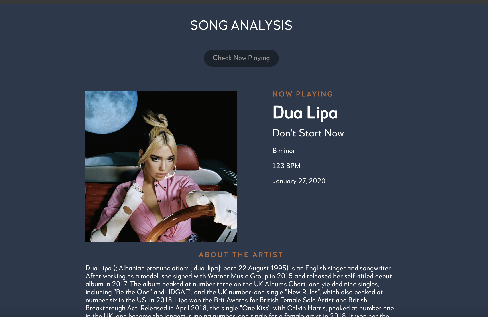
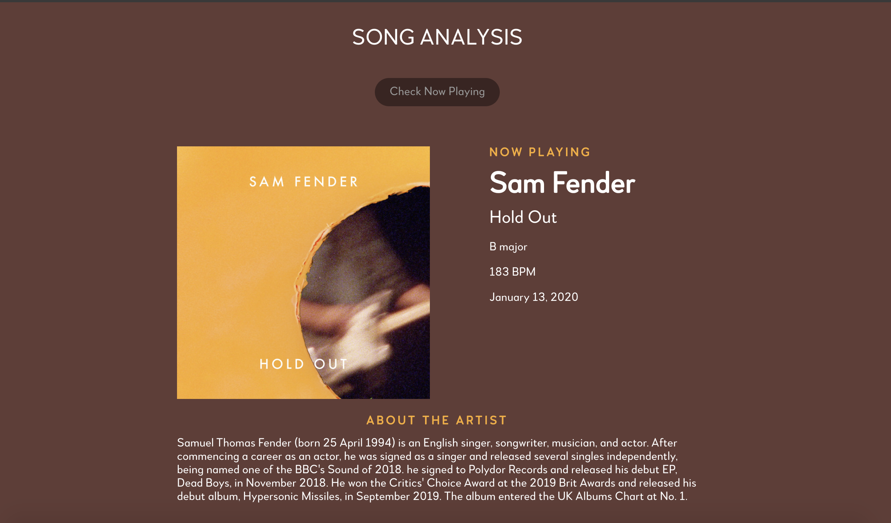
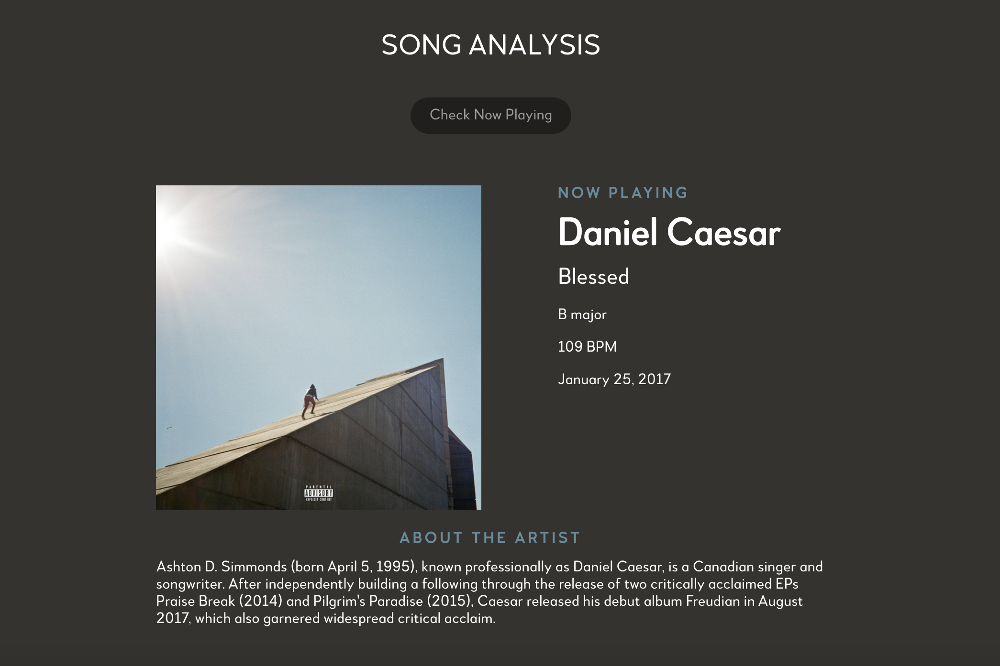

<!-- ABOUT THE PROJECT -->
## About The Project

A web app displaying additional information about the song you are currently listening to on Spotify including it's musical key, beats per minute (BPM) and a short bio about the artist. The background and accent colours will also change for each song, based on the most prominant colours from the album art. 

  


### Built With
* [React.js](https://reactjs.org/)
* [SCSS](https://sass-lang.com/documentation/syntax)
* [Spoitify API](https://developer.spotify.com/documentation/web-api/)
* [Wikipedia API](https://www.mediawiki.org/wiki/API:Main_page)


## Getting Started

### Installation
1. Clone the github respository.
```
git clone https://github.com/tdsimpson/Song-Analysis.git
```

2. Install the dependencies
```
npm install
```
### Running
1. Change directories into the auth-server folder and run authorization code. This is used so Spotify can authorize your account.
```
cd auth server
```
```
node authorization_code/app.js
```

2. In another terminal, change directories into the client folder and run the app
```
cd client
```
```
npm start
```

